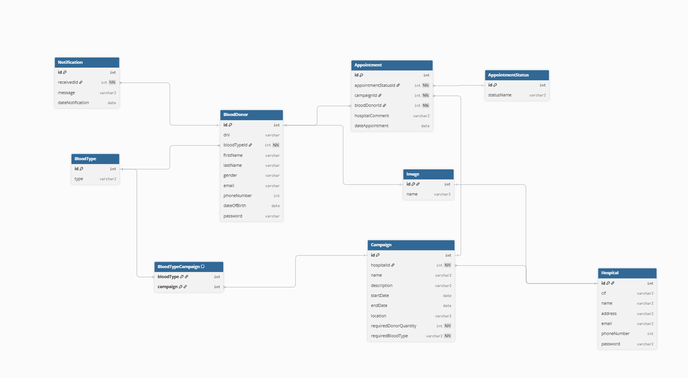
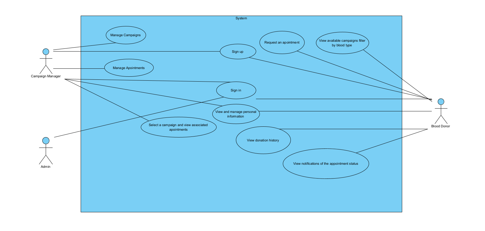
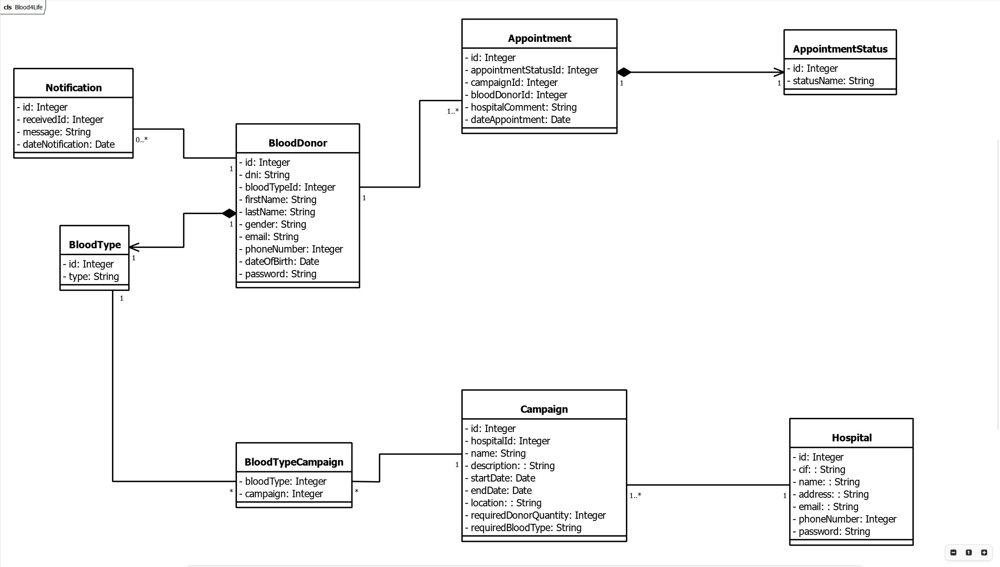

# Blood4Life

## About this project

This repository constitutes a project that mix all our subjects of the Higher-Level Training Cycle in Web Application
Development
that we are currently completing. The project consists of a full-stack application, meaning it encompasses an entire
server infrastructure that defines its existence, logic, and storage, ensuring complete, robust, and proper
functionality based on configurations we decided upon collectively.

The guiding theme for developing this project is that it must be social. We thought of an implementation purpose that
would improve and aid the management of blood donations for the hospitals.

## Technologies Used

* Backend: [](https://spring.io/projects/spring-boot)
* Migrations & seeders: [](https://flywaydb.org/)
* ORM: [](https://hibernate.org/)
* Database: [](https://www.mysql.com/)
* Local Database: [](https://docs.docker.com/desktop/setup/install/windows-install/)
* Frontend: [](https://es.react.dev/)
* API Endpoints: [](https://www.postman.com/)
* Database & Backend deploy: [](https://railway.app/)
* Interface design: [](https://www.figma.com/)
* Versions control: [](https://www.sourcetreeapp.com/)

## Other technologies used

* [](https://www.jetbrains.com/es-es/idea/)
* [](https://vite.dev/)
* [](https://nodejs.org/en/download/)
* [](https://firebase.google.com/?hl=es-419)

## ERD



## Use case diagram



## Classes diagram



# Backend

### Requirements

To run the **backend** of the application, the user must have installed:

- [](https://docs.aws.amazon.com/corretto/latest/corretto-17-ug/downloads-list.html)
- [](https://docs.docker.com/desktop/setup/install/windows-install/)

### Instructions to run the backend

1. **Clone the repository**:

```bash
git clone https://github.com/xiomi94/blood4life.git
```

2. Run the .bat file in the repository. This file will automatically configure the ```application.properties``` file to
   prepare the backend environment.

3. Verify if in Docker Desktop there is a new container. You can see that is automatically started.

4. Start Spring Boot

# Frontend

## Requirements

* [](https://nodejs.org/en/download/)
* [](https://www.jetbrains.com/es-es/idea/) (
  Or another IDE, what you want, we chose this)

##### (Optional)

* [](https://www.sourcetreeapp.com/)

First, you need to open a terminal in a directory of your preferences and insert the following command:

```bash
git clone https://github.com/xiomi94/blood4life
```

Then open the IDE:

```bash
npm install 
```

```bash
npm run dev
``` 
to visualizing the app in localhost

#### Firebase section

```bash
firebase init
```

In case is the first time using firebase it will ask you to log in an account.

In our case we selected "Hosting" option, choose your preferences.

```bash
npm run build
```

```bash
firebase deploy
```

Next there will be an explanation for the automatic
deployment (automatic integration).

You need to generate a secret key at console firebase page in project configuration, it results in a file .json format that need the ```firebase.json``` reference for github 

### GitHub Actions + Firebase Hosting Flow (for better explanation we did a diagram simulation)

```text
   [Your GitHub Repository]
               |
               |  (push / merge to main)
               v
     [GitHub Actions Workflow]
               |
               |  uses the secret
               v
   [FIREBASE_SERVICE_ACCOUNT JSON]  <-- secure secret
               |
               |  authentication
               v
          [Firebase Hosting]
               |
               |  receives your build
               v
      [Your app deployed online]
```

### Step-by-step Explanation

```
1. Push to repository: GitHub Actions triggers according to your workflow (on: push).

2. Workflow executes steps: installs Node.js, builds your app, etc.

3. Accesses the secret FIREBASE_SERVICE_ACCOUNT: the JSON tells Firebase that this is an authorized account.

4. Firebase Hosting action uses the JSON to authenticate.

5. Firebase accepts the connection and uploads the build folder (or whatever folder you specified in firebase.json).

6. Your app is live online on Firebase Hosting.
```

## Project Links

* [](https://github.com/xiomi94/blood4life-frontend)
* [](https://www.figma.com/design/b1wzQ5d4tamVixL3SZzZrg/Blood4Life?node-id=0-1&p=f&t=4vENweVa6vCEpXQd-0)
* [](https://github.com/users/xiomi94/projects/5/views/1)
* [](https://documenter.getpostman.com/view/45089686/2sB3WsPf8P)

## Authors

| Nombre       | Apellidos         |
|--------------|-------------------|
| Xiomara      | Jiménez Velázquez |
| Juan Antonio | Sánchez Martel    |

